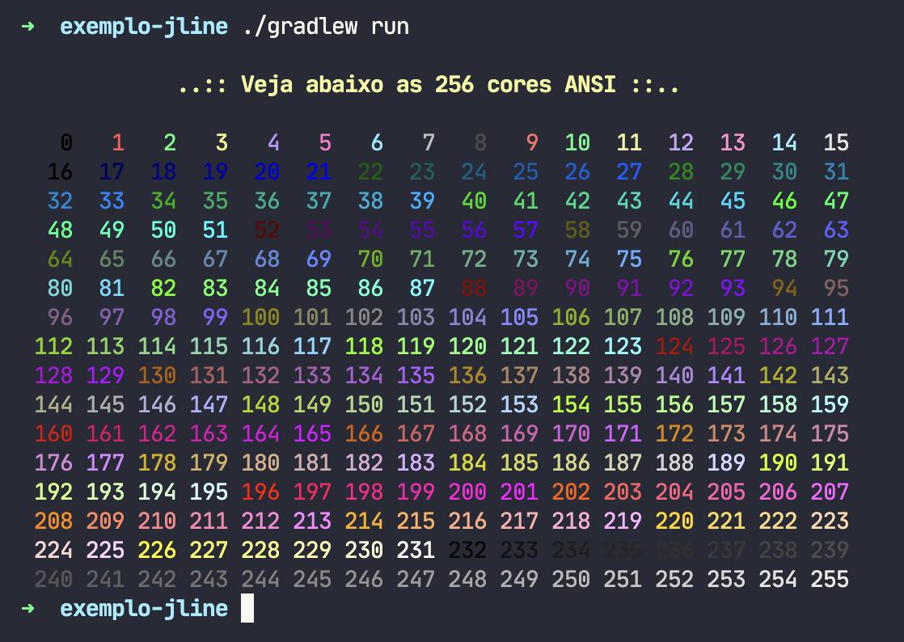

# Exemplo de uso da biblioteca JLine

[JLine](https://github.com/jline/jline3) é uma biblioteca Java para a criação de interfaces de linha de comando interativas. Fornece funcionalidades como edição de linha, manipulação de histórico de comandos, autocompletar, cores e suporte a diferentes terminais e sistemas operacionais.

Para uso da biblioteca, é necessário adicionar a dependência no arquivo [`build.gradle.kts`](app/build.gradle.kts), sendo que detalhes sobre a biblioteca foi obtida no site [Maven Repository](https://mvnrepository.com/search?q=jline).

```gradle
// linhas acima foram omitidas

dependencies {
    implementation("org.jline:jline:3.27.0")

    // demais dependências
}

// Define o System.in como entrada padrão para a execução do programa com o gradle
tasks.run.configure {
    standardInput = System.`in`
}

// linhas abaixo foram omitidas
```
## Captura de tela do exemplo


